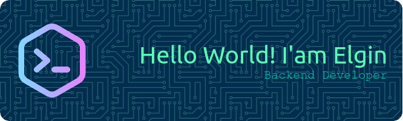

  

  

###

<h1 align="center">Hi 👋, I'm Elgin Al-wafi</h1>

###

<h3 align="left">👩‍💻  About Me</h3>

###

I'm a Junior Developer from Indonesian  - 🔭 I’m working as Serabutan - 📚 I'm currently learning Python 3 - ⚡ In my free time I work on projects from freelance clients.

###

<h3 align="left">🛠 Language and tools</h3>

###

                            

###

<h3 align="left">🔥 My Stats :</h3>

###

  
  
  
  
  

###

  

###

  

###
